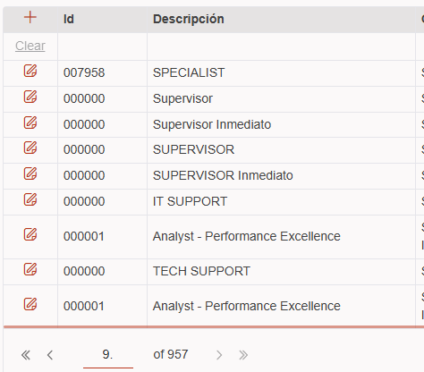
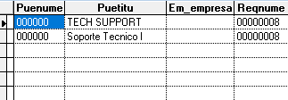

# Solicitud

Favor tomar el último proyecto que te envíe (EIKON.UI) y busques los formularios:  FRHCL101 - FRHCL111, la tarea es agregarle las validaciones para que no permitan enviar el formulario con los campos de texto en blanco, o fechas vacías, o las listas sin seleccionar un elemento...

## Cambios realizados 🧠

### Componentes 🧱

#### HeaderForm
- Se ha creado un componente para los header, ya que el codigo puede llegar a ser repetitivo para muchos Forms, optimizando el archivo y el proyecto.

---------
## Bugs 🐞

### Creacion de Cargo

- Al crear un cargo a traves de  una requisicion, se le otorga un ID 000000.
- Al crear el cargo se asigna a la empresa ID " ", la cual no corresponde.

**prioridad:** Es alta ya que no permite crear correctamente los cargos.
**Riesgo:**  Alto ya que no tiene un ID Correcto, Y la empresa a la que pertenece es fantasma.

