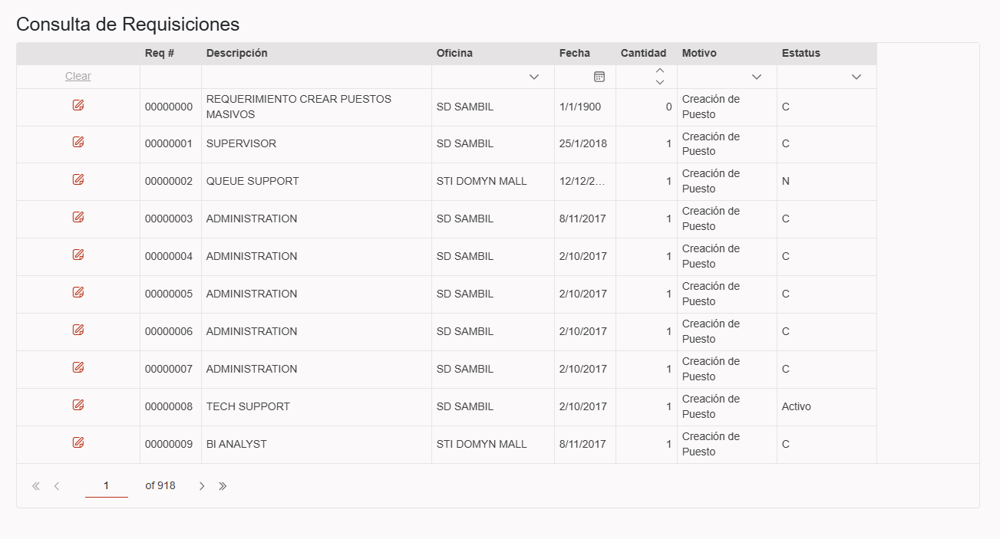
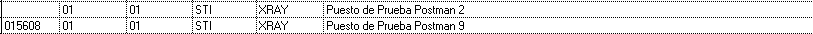
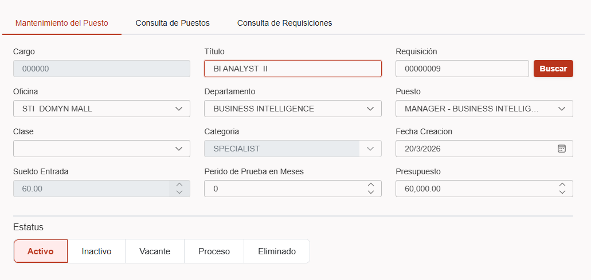
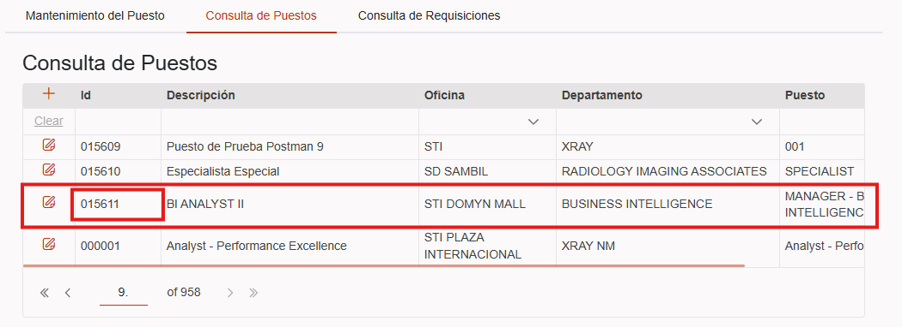
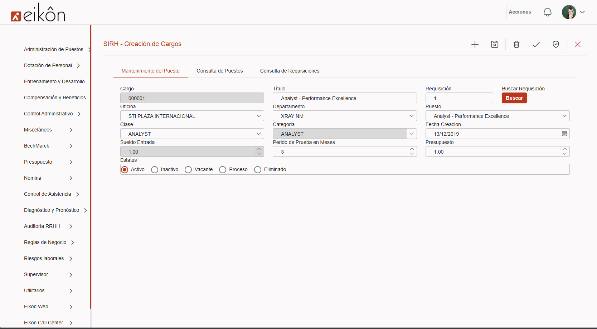
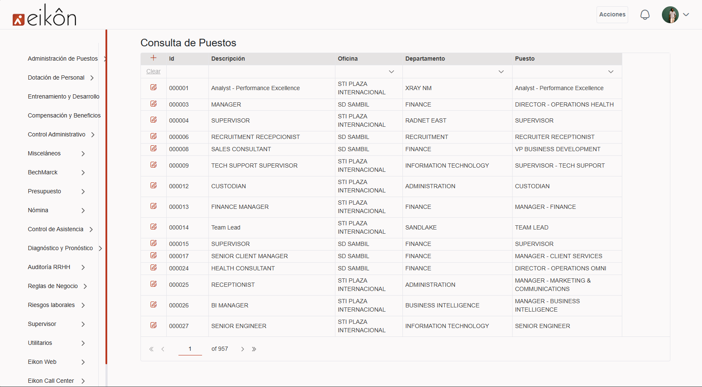

# Solicitud

Favor tomar el último proyecto que te envíe (EIKON.UI) y busques los formularios:  FRHCL101 - FRHCL111, la tarea es agregarle las validaciones para que no permitan enviar el formulario con los campos de texto en blanco, o fechas vacías, o las listas sin seleccionar un elemento...

-----------------
## Cambios realizados 🧠

### Metodos ⚙️

#### CargarRegistro()
- Se añadio un replace a los SelectedItem para eliminar los espacios. SelectedItem.xxxnume.Replace(oldValue: " ", newValue: "")

### Componentes 🧱

#### HeaderForm
- Se ha creado un componente para los header, ya que el codigo puede llegar a ser repetitivo para muchos Forms, optimizando el archivo y el proyecto.

#### DxTextBox
- Se agrego metodo para cargar registros al hacer Enter.

### Estilos

#### Animaciones
- Se agrego un Slide para cada tab.
- Se añadieron estilos personalizables para los inputs: Eikoninput, EikonReadOnly, EikonError.

#### Reemplazo
- Se Reemplazo Width por MinWidth en las tablas ya que dependiendo de la pantalla quedaban espacios vacios.

---------
# Bugs 🐞

## Creacion de Cargo

### Problema

- Al crear un cargo a traves de  una requisicion, se le otorga un ID 000000.

**prioridad:** Es alta ya que no permite crear correctamente los cargos.
**Riesgo:**  Alto ya que no tiene un ID Correcto.

### Refactoring

Al parecer exisita un error en el controlador el cual tomaba unica y exclusivamente el ID Pasado por la UI y no generaba el ID con el contador Proporcionado por el Prhlib00. por lo que procedimos a hacer dos cambios en la Api:

- Cambiamos cambiamos la entidad para que guardara en Puenume la variable devuelta por prhlib00, pasando de "`Puenume = dto.Puenume,`" a "`Puenume = puenumeGenerado`".
- Cambiamos la consulta en Prhlib00 pues existia un choque de cantidad de caracteres. Colocamos un Trim(), para quitar los espacios vacios y hacer la consulta correctamente.

Con estos cambios Pasamos de tener cargos con Puenume " " o "000000" a "Mrhcc000.Secuencia + 1".

## Post a BD con empresa " "

### Problema

Al hacer un HTTP Post se crea en la BD con la empresa " ", en los casos donde no se pasa la empresa.

### Solucion

- Creamos en el servicio API GetEmpresa y SetEmpresa.
- Hacemos un setEmpresa en el Login para poder Guardarlo
- En los formularios al inicializarlos se podra obtener La empresa actual del colaborador para asi hacer la peticion correctamente.

# Validaciones de campos

- Modificamos el FRHPU010Dto para que los campos fueran Requierd y asi sea mas facil la validacion.
- Creamos un EditContext para poder tener acceso al contexto y saber cuando los inputs estan vacios.
- Se crearon los estilos para los inputs vacios con validacion.

#### Creacion de cargo Ejemplo

# Before

